# 🛒 EasyShop - E-Commerce DevOps Project

## Project Overview

EasyShop is a full-stack e-commerce application deployed on AWS EKS using an automated DevOps and GitOps workflow.

The project demonstrates the complete flow from source-code commit to application deployment, including:

- Infrastructure provisioning using Terraform
- AWS VPC and EKS
- Jenkins CI pipeline
- Docker containerization
- Trivy security scanning
- Docker Hub image registry
- GitOps using Argo CD
- Kubernetes deployment
- NGINX Ingress
- HTTPS using cert-manager and Let's Encrypt
- Horizontal Pod Autoscaling
- Prometheus and Grafana monitoring
- Grafana Alerting and email notifications

The main goal of the project is to automate application delivery while making the infrastructure reproducible, deployments traceable, and the application scalable and observable.

## Application Features

- User authentication using JWT
- Product browsing and search
- Product categories
- Shopping cart
- Checkout
- User profiles
- Order history
- Responsive UI
- Dark and light mode

## Technology Stack

| Category | Technology |
|---|---|
| Application | Next.js, TypeScript |
| Database | MongoDB |
| Cloud | AWS |
| Infrastructure | Terraform |
| Containerization | Docker |
| CI | Jenkins |
| Security Scanning | Trivy |
| Container Registry | Docker Hub |
| Kubernetes | Amazon EKS |
| CD / GitOps | Argo CD |
| Ingress | NGINX Ingress Controller |
| TLS | cert-manager + Let's Encrypt |
| Autoscaling | Kubernetes HPA |
| Metrics | Metrics Server |
| Monitoring | Prometheus + Grafana |

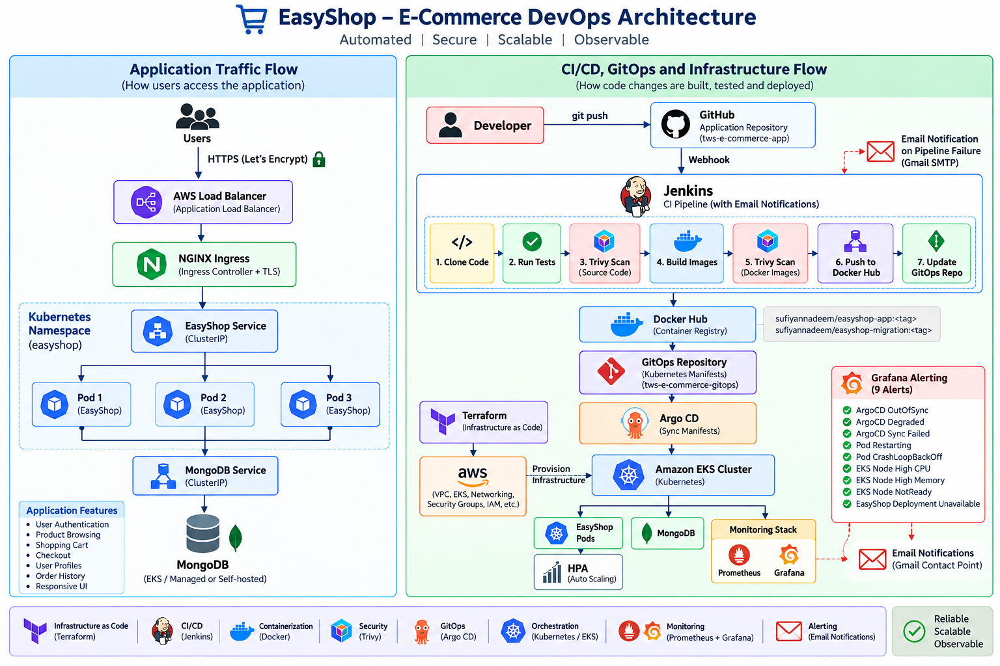

## 🎥 Project Demo

A complete walkthrough of the EasyShop DevOps implementation, covering:

- AWS infrastructure provisioned with Terraform
- Jenkins CI/CD pipeline
- Docker image build and push
- Trivy security scanning
- GitOps with Argo CD
- Kubernetes deployment on Amazon EKS
- NGINX Ingress and HTTPS
- Prometheus and Grafana monitoring
- Grafana alerting and email notifications

## Project Repositories

### Application Repository

https://github.com/sufiyannadeem/tws-e-commerce-app.git

Contains the application source code, Dockerfiles, Jenkins pipeline and Terraform infrastructure.

### GitOps Repository

https://github.com/sufiyannadeem/tws-e-commerce-gitops.git

Contains the Kubernetes manifests used by Argo CD for deployment.

## CI/CD Pipeline

The project uses Jenkins to automate the continuous integration process and follows a GitOps-based deployment approach.

### Jenkins Pipeline Stages

| Stage | Description |
|---|---|
| **Cleanup Workspace** | Removes files from previous builds |
| **Clone Repository** | Clones the application source code from GitHub |
| **Run Tests** | Runs application tests |
| **Trivy Filesystem Scan** | Scans the source code and dependencies for vulnerabilities |
| **Build Docker Images** | Builds the EasyShop application and database migration images |
| **Trivy Docker Image Scan** | Scans the Docker images for vulnerabilities |
| **Push Docker Images** | Pushes the verified images to Docker Hub |
| **Update GitOps Manifests** | Updates the Docker image tags in the GitOps repository |
| **Argo CD Deployment** | Argo CD detects the GitOps change and synchronizes the application to Amazon EKS |

### CI/CD Workflow

The overall workflow is:

**GitHub → Jenkins → Test → Trivy Scan → Docker Build → Trivy Image Scan → Docker Hub → GitOps Repository → Argo CD → Amazon EKS**

Jenkins performs the CI activities, while Argo CD handles the Kubernetes deployment using the GitOps repository as the source of truth.

### Jenkins Pipeline

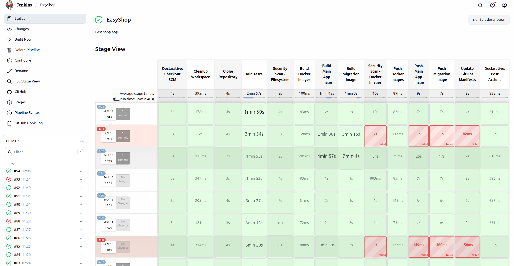

## Docker Images

The Jenkins pipeline builds two Docker images:

sufiyannadeem/easyshop-app:<BUILD_NUMBER>  
sufiyannadeem/easyshop-migration:<BUILD_NUMBER>

The application image contains the EasyShop application, while the migration image is used to execute database migrations before deployment.

Images are scanned with Trivy before being pushed to Docker Hub.

### Docker Hub Images

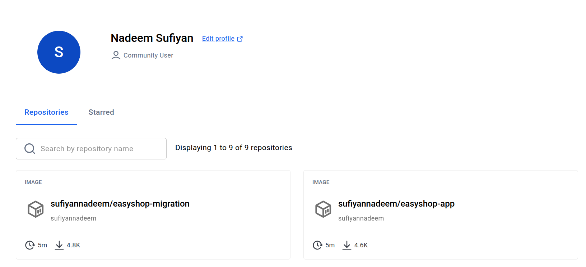

## Security Scanning

Trivy is integrated into the Jenkins pipeline for container and filesystem security scanning.

## Filesystem Scan

The source code and project dependencies are scanned before Docker image creation.

**Source Code** → **Trivy Filesystem Scan** → **Docker Build**

## Docker Image Scan

Docker images are scanned after they are built and before they are pushed to Docker Hub.

**Docker Build** → **Trivy Image Scan** → **Docker Hub**

This provides security checks at both the source-code and container-image stages.

## Jenkins Shared Library

A Jenkins Shared Library is used to keep reusable CI/CD logic separate from the application pipeline.

The shared library provides reusable functionality for tasks such as:

- Docker image building
- Docker image scanning
- Docker Hub authentication
- GitOps repository updates
- Updating Kubernetes image tags

This approach keeps the Jenkinsfile cleaner and makes the pipeline logic reusable across projects.

### Jenkins Email Notifications

Jenkins is configured with email notifications to provide immediate feedback when a CI pipeline fails.

- SMTP: Gmail SMTP
- Notification recipient: configured project email address
- Trigger: Jenkins pipeline failure
- Notification method: `emailext`

When a pipeline fails, Jenkins automatically sends an email containing the build status and a link to the failed build.

### Jenkins Failure Notification

[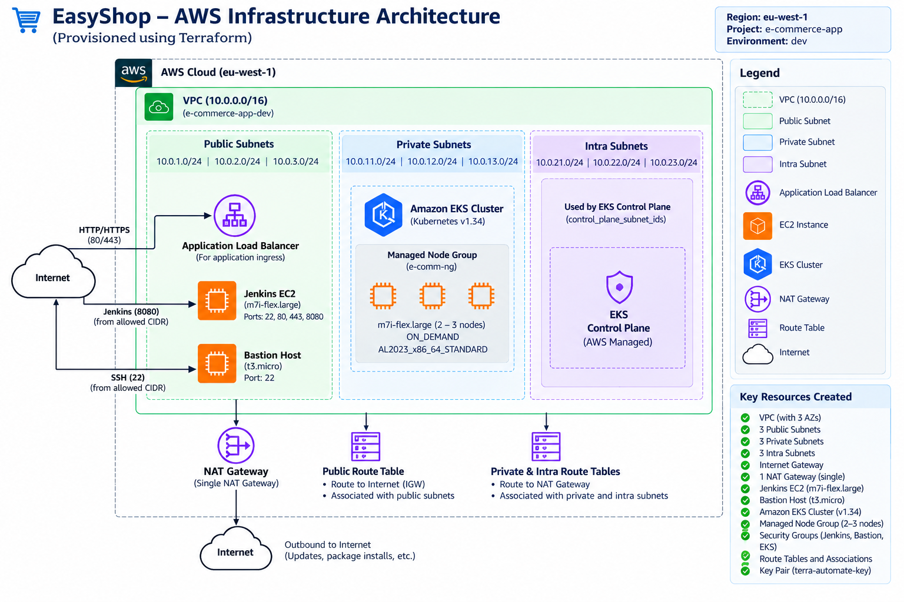](https://youtu.be/h5ElrDxTPh4)

**CI failure flow:**

**GitHub → Jenkins → Test / Scan / Build → Failure → Email Notification**

## GitOps with Argo CD

The project follows a GitOps-based deployment model.

The application source code and Kubernetes deployment manifests are maintained in separate repositories.

## Deployment Flow

**Application Repository** → **Jenkins** → **Build + Test + Scan** → **Docker Hub** → **Update Image Tag** → **GitOps Repository** → **Argo CD** → **AWS EKS**

Jenkins does not directly deploy the application to Kubernetes.

Instead, Jenkins updates the image tag in the GitOps repository. Argo CD detects the Git change and synchronizes the Kubernetes manifests with the EKS cluster.

### Argo CD Application

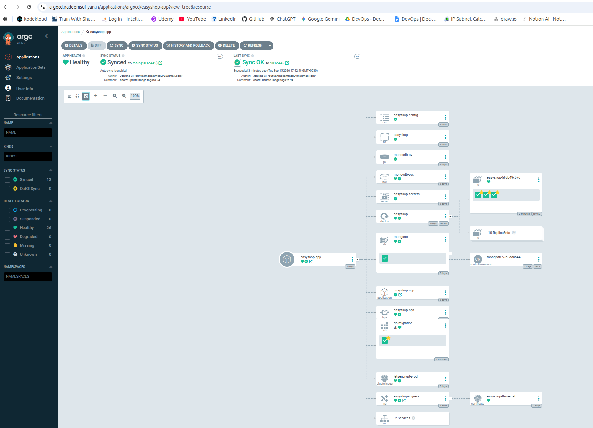

## Kubernetes Deployment

The application is deployed on Amazon EKS using Kubernetes resources.

The deployment includes:

- Deployment
- Service
- Ingress
- ConfigMap
- Secret
- HPA
- MongoDB
- Database migration Job

The EasyShop application runs with multiple replicas to provide availability and allow Kubernetes to distribute traffic between pods.

## Database Migration

Database migrations are executed automatically using a dedicated Kubernetes Job.

The migration Job runs before the application deployment using an Argo CD PreSync hook.

**Argo CD Sync** → **PreSync Migration Job** → **MongoDB Migration** → **EasyShop Deployment**

The migration Job uses a separate Docker image:

sufiyannadeem/easyshop-migration:<BUILD_NUMBER>

This ensures that database changes are applied as part of the deployment process.

## NGINX Ingress and HTTPS

NGINX Ingress is used to route external traffic to the EasyShop application.

**User** → **HTTPS** → **AWS Load Balancer** → **NGINX Ingress** → **EasyShop Service** → **EasyShop Pods**

The application is exposed using:

easyshop.nadeemsufiyan.in

HTTPS certificates are automatically managed using:

- cert-manager
- Let's Encrypt
- Kubernetes TLS Secret

This provides encrypted HTTPS communication between users and the application.

### Live EasyShop Application

## Horizontal Pod Autoscaling

Horizontal Pod Autoscaler (HPA) is configured for the EasyShop application.

Current configuration:  

Minimum Replicas: 3  
Maximum Replicas: 5  
CPU Target: 70%

When CPU utilization increases, Kubernetes can automatically increase the number of EasyShop pods.

When resource usage decreases, Kubernetes can reduce the number of replicas while respecting the configured minimum.

## Monitoring

The Kubernetes environment is monitored using Prometheus and Grafana.

## Monitoring Stack:

**AWS EKS** → **Prometheus** → **Grafana**

Prometheus collects Kubernetes and application-related metrics, while Grafana provides dashboards for visualization and monitoring.

Metrics Server is also used by Kubernetes HPA for CPU and resource utilization metrics.

### Grafana Argo CD Dashboard

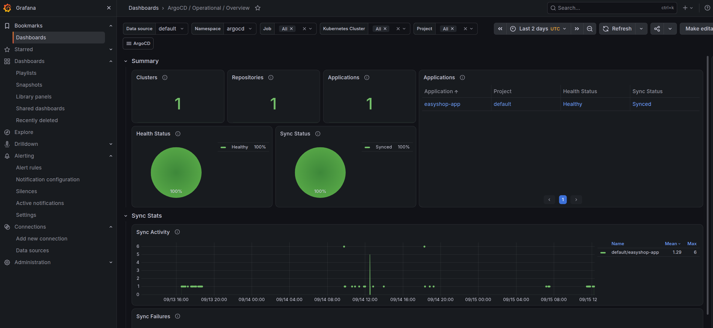

### Grafana Alerting

Grafana Alerting is configured to continuously evaluate Prometheus metrics and send email notifications through a Gmail contact point when production-relevant conditions occur.

**Alert notification flow:**

**Prometheus → Grafana Alerting → Gmail Contact Point → Email Notification**

The project currently includes the following alerts:

| Alert | Purpose |
|---|---|
| **ArgoCD Application OutOfSync** | Detects applications that are not synchronized with the GitOps repository |
| **ArgoCD Application Degraded** | Detects ArgoCD applications in a degraded health state |
| **ArgoCD Sync Failed** | Detects failed ArgoCD synchronization operations |
| **Kubernetes Pod Restarting** | Detects repeated Kubernetes container restarts |
| **Kubernetes Pod CrashLoopBackOff** | Detects containers repeatedly failing and entering CrashLoopBackOff |
| **EKS Node High CPU** | Detects high CPU utilization on EKS worker nodes |
| **EKS Node High Memory** | Detects high memory utilization on EKS worker nodes |
| **EKS Node NotReady** | Detects EKS worker nodes that are no longer Ready |
| **EasyShop Deployment Unavailable** | Detects unavailable EasyShop deployment replicas |

Grafana evaluates these alert rules at regular intervals and uses the configured **Gmail Alerts** contact point for notifications.

This provides monitoring coverage across:

- ArgoCD / GitOps health
- Kubernetes workloads
- EKS worker-node resources
- EasyShop deployment availability
- Pod failures and restart conditions

**Monitoring and notification flow:**

**AWS EKS → Prometheus → Grafana Dashboards + Grafana Alerting → Gmail**

### Grafana Alert Rules

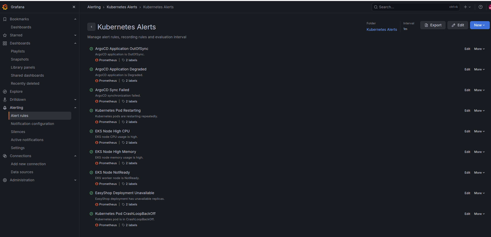

### Grafana Email Notification Test

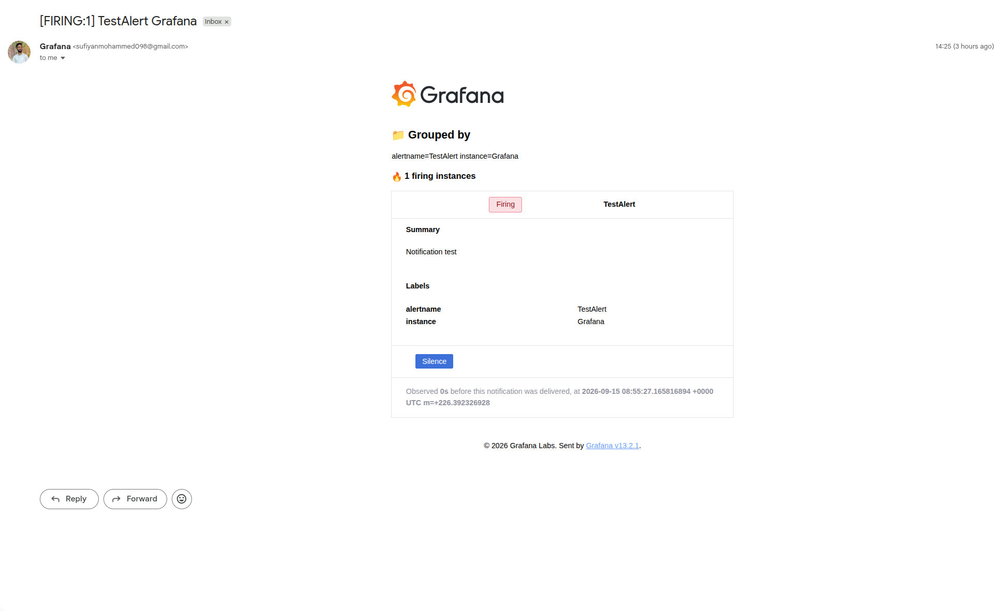

## Infrastructure as Code

AWS infrastructure is provisioned using Terraform.

The Terraform configuration creates and manages:

- VPC
- Public and private subnets
- Internet Gateway
- NAT Gateway
- Security Groups
- Jenkins EC2 instance
- Bastion Host
- Amazon EKS Cluster
- EKS Managed Node Group
- EKS Add-ons

Using Terraform makes the infrastructure reproducible and version-controlled.

## AWS Infrastructure

The project uses the following AWS components:

| AWS Service     | Purpose                        |
| --------------- | ------------------------------ |
| VPC             | Network isolation              |
| EC2             | Jenkins and Bastion Host       |
| EKS             | Kubernetes cluster             |
| Load Balancer   | External application access    |
| NAT Gateway     | Private subnet internet access |
| IAM             | Access control                 |
| Security Groups | Network security               |

The EKS worker nodes run in private subnets, while Jenkins and the Bastion Host are deployed in public subnets.

### AWS VPC

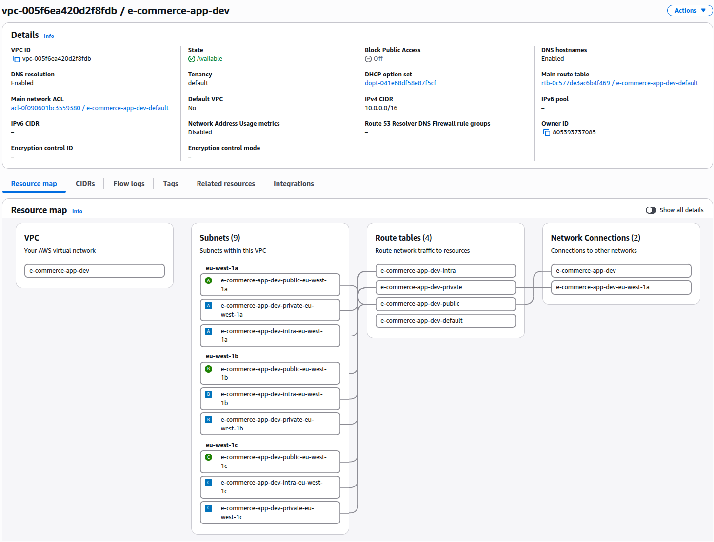

### Amazon EKS Cluster

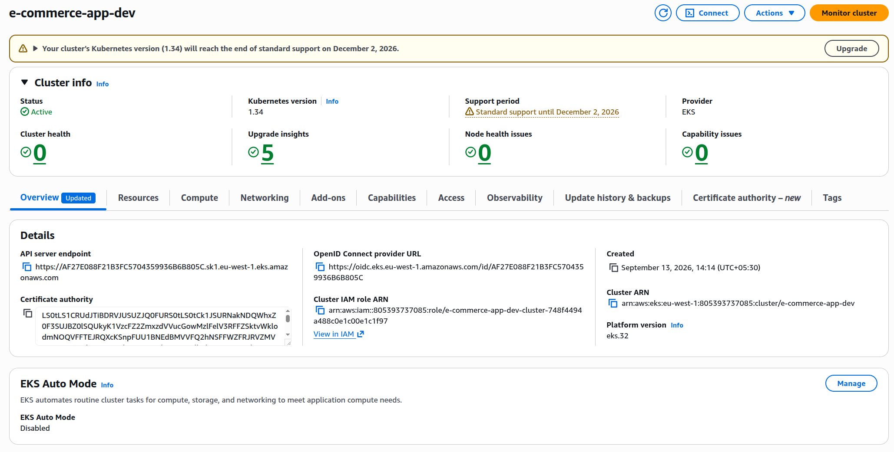

### EKS Worker Nodes

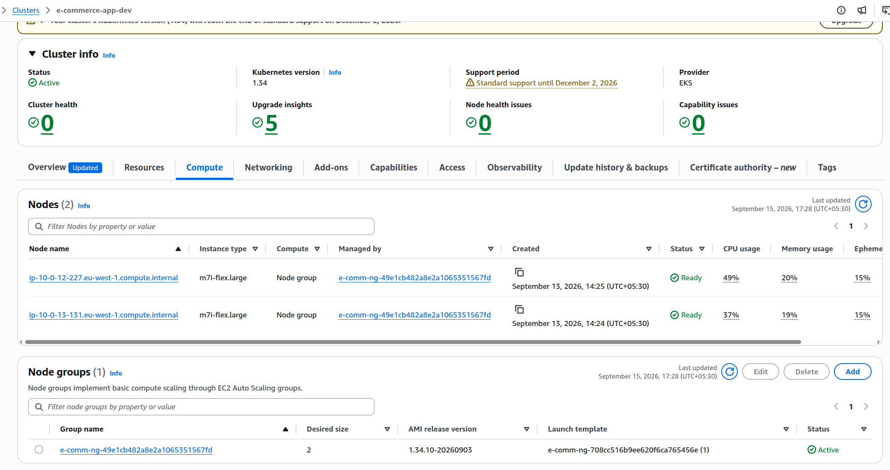

## Major DevOps Challenge

One of the deployment challenges was handling Kubernetes database migration Jobs with Argo CD.

Kubernetes Jobs have immutable pod templates. Updating the Docker image of an existing Job caused Argo CD synchronization to fail because the existing Job could not be updated in place.

The solution was to configure the migration Job as an Argo CD PreSync hook with:

annotations:  
  argocd.argoproj.io/hook: PreSync  
  argocd.argoproj.io/hook-delete-policy: BeforeHookCreation

This allows the previous migration Job to be removed before creating the new Job during deployment.

## Key DevOps Practices Implemented

- Infrastructure as Code with Terraform
- AWS VPC and EKS
- Kubernetes container orchestration
- Jenkins CI/CD
- Jenkins Shared Library
- Email notifications for Jenkins CI failures
- Docker containerization
- Trivy security scanning
- Docker Hub image registry
- GitOps deployment model
- Argo CD continuous delivery
- NGINX Ingress
- HTTPS with cert-manager and Let's Encrypt
- Kubernetes HPA
- Prometheus monitoring
- Grafana dashboards
- Grafana Alerting
- Email notifications for Grafana monitoring alerts
- Automated database migrations

## Project Outcome

This project demonstrates an end-to-end DevOps workflow for deploying a containerized e-commerce application on AWS.

The implementation covers the complete lifecycle:

**Code** → **GitHub** → **Jenkins** → **Test** → **Security Scan** → **Docker Build** → **Docker Image Scan** → **Docker Hub** → **GitOps Repository** → **Argo CD** → **Amazon EKS** → **NGINX Ingress** → **HTTPS** → **Users**

The infrastructure, CI/CD pipeline, security scanning, GitOps deployment, autoscaling, HTTPS, monitoring, and database migration are automated and managed using modern DevOps practices.

## Project Attribution

The EasyShop application is based on an MIT-licensed open-source project.

The DevOps implementation focuses on designing and implementing the infrastructure and deployment workflow, including:

- AWS infrastructure using Terraform
- Amazon EKS
- Jenkins CI/CD
- Docker containerization
- Trivy security scanning
- Docker Hub
- GitOps with Argo CD
- NGINX Ingress
- HTTPS with cert-manager and Let's Encrypt
- Kubernetes HPA
- Prometheus and Grafana monitoring
- Automated database migration

