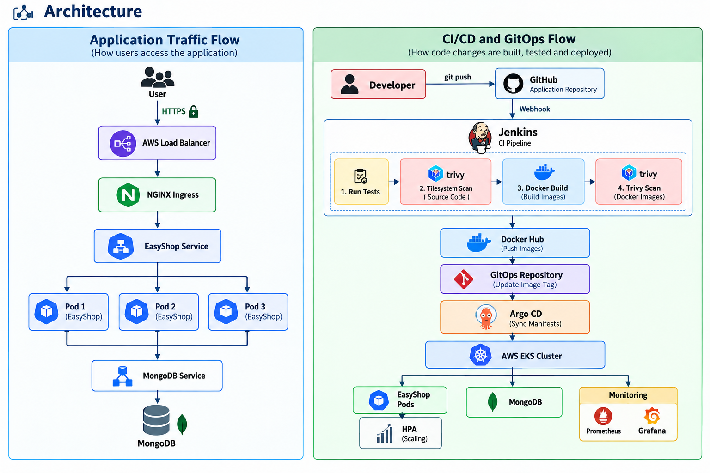

# 🛒 EasyShop - E-Commerce DevOps Project

## Project Overview

EasyShop is a full-stack e-commerce application deployed on AWS EKS using an automated DevOps and GitOps workflow.

The project demonstrates the complete flow from source-code commit to application deployment, including:

- Infrastructure provisioning using Terraform
- AWS VPC and EKS
- Jenkins CI pipeline
- Docker containerization
- Trivy security scanning
- Docker Hub image registry
- GitOps using Argo CD
- Kubernetes deployment
- NGINX Ingress
- HTTPS using cert-manager and Let's Encrypt
- Horizontal Pod Autoscaling
- Prometheus and Grafana monitoring

The main goal of the project is to automate application delivery while making the infrastructure reproducible, deployments traceable, and the application scalable and observable.

## Technology Stack

| Category | Technology |
|---|---|
| Application | Next.js, TypeScript |
| Database | MongoDB |
| Cloud | AWS |
| Infrastructure | Terraform |
| Containerization | Docker |
| CI | Jenkins |
| Security Scanning | Trivy |
| Container Registry | Docker Hub |
| Kubernetes | Amazon EKS |
| CD / GitOps | Argo CD |
| Ingress | NGINX Ingress Controller |
| TLS | cert-manager + Let's Encrypt |
| Autoscaling | Kubernetes HPA |
| Metrics | Metrics Server |
| Monitoring | Prometheus + Grafana |

## Project Repositories

### Application Repository

https://github.com/sufiyannadeem/tws-e-commerce-app.git

Contains the application source code, Dockerfiles, Jenkins pipeline and Terraform infrastructure.

### GitOps Repository

https://github.com/sufiyannadeem/tws-e-commerce-gitops.git

Contains the Kubernetes manifests used by Argo CD for deployment.

---

